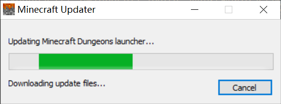
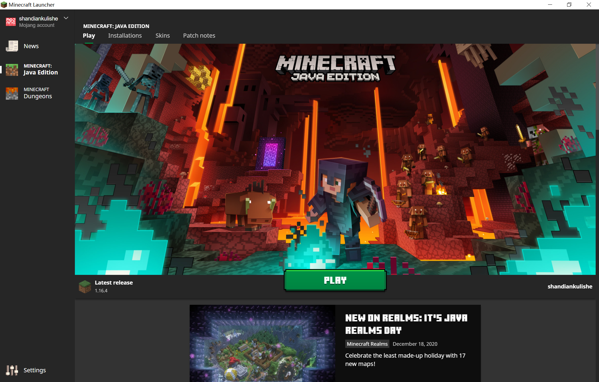
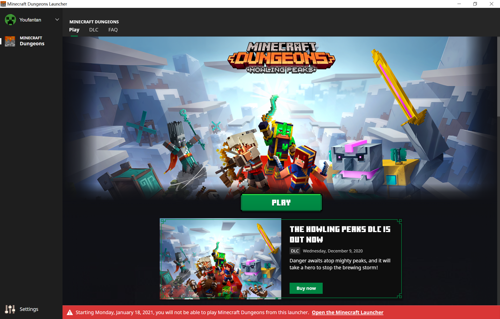
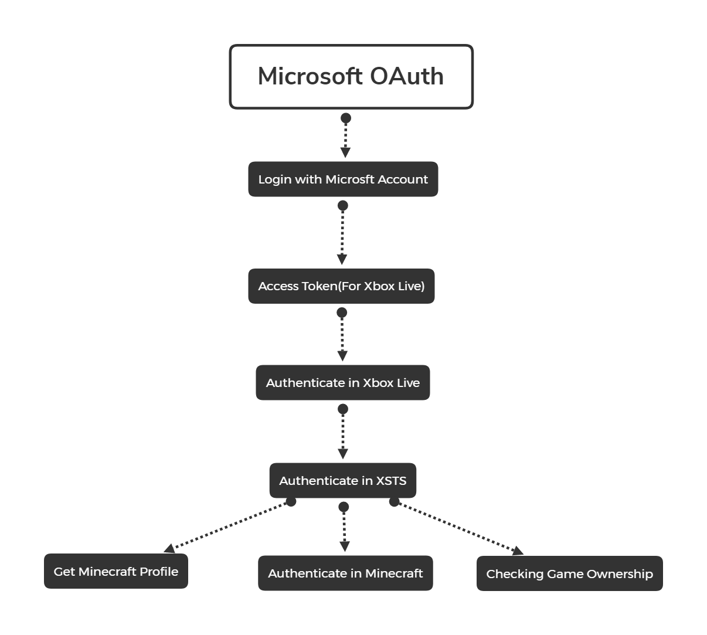

# 初探Microsoft OAuth
## 感谢

这篇文章并非第一篇讲解Minecraft新版验证方法的文章，在写这篇文章之前，作者还参考了许多成熟的启动器示例以及指南，这些资源的价值比这篇文章要高得多，所以作者在这里列出来，方便读者参考

[wiki.vg](https://wiki.vg/Microsoft_Authentication_Scheme)  
[【编程开发】初探新版Minecraft正版验证方法](https://www.bilibili.com/read/cv8722213)  
[wiki.vg(汉化后)](https://wiki.vg/ZH:Microsoft_Authentication_Scheme)  
[MiniLauncher(部分源码)](https://github.com/MiniDigger/MiniLauncher/blob/master/launcher/src/main/java/me/minidigger/minecraftlauncher/launcher/gui/MsaFragmentController.java)  
[HMCL(部分源码)](https://github.com/huanghongxun/HMCL/blob/javafx/HMCL/src/main/java/org/jackhuang/hmcl/ui/account/MicrosoftAccountLoginStage.java)  
[node-minecraft-protocol](https://github.com/PrismarineJS/node-minecraft-protocol/blob/master/src/client/microsoftAuth.js)

## 正文

*注：这一章仅为科普理论，如果不想读可直接跳过*

### 什么是Micrsoft OAuth

>Microsoft 标识平台有助于你构建这样的应用程序，你的用户和客户登录它们来使用其 Microsoft 标识或社交帐户，并提供对你的 API 或 Microsoft API（例如 Microsoft Graph）的授权访问。
>Microsoft 标识平台由多个组件组成：
+ 符合 OAuth 2.0 和 OpenID Connect 标准的身份验证服务，使开发人员能够对多个标识类型进行身份验证并，包括：
    - 通过 Azure AD 预配的工作或学校帐户
    - 个人 Microsoft 帐户（例如 Skype、Xbox 和 Outlook.com）
    - 社交或本地帐户（通过 Azure AD B2C）
+ 开放源代码库：Microsoft 身份验证库 (MSAL)，并支持其他符合标准的库
+ 应用程序管理门户：Azure 门户中注册和配置体验，以及其他 Azure 管理功能。
+ 应用程序配置 API 和 PowerShell：允许通过 Microsoft Graph API 和 PowerShell 以编程方式配置应用程序，以便自动执行 DevOps 任务。
+ 开发人员内容：技术文档，包括快速入门、教程、操作指南和代码示例。

>对于开发人员而言，Microsoft 标识平台可集成到标识和安全领域的新式创新中，例如无密码身份验证、升级身份验证和条件访问。 你不需要自己实现这样的功能：集成了 Microsoft 标识平台的应用程序原本就可以利用这样的创新。  
>使用 Microsoft 标识平台，你可以编写一次代码并影响任何用户。 你可以构建一次应用并使其在许多平台上运行，也可以构建充当客户端以及资源应用程序 (API) 的应用。

>（部分自[Microsoft-Docs](https://docs.microsoft.com/zh-cn/azure/active-directory/develop/v2-overview)）

### 为什么要迁移至Microsoft OAuth

显而易见，过去的Yggdrasil安全性实在是太差了，举个最好的例子就是[authlib-injector](https://github.com/yushijinhun/authlib-injector)。这是一个外置皮肤站的插件，能够劫持authlib的验证并接入第三方皮肤数据库伪装验证，验证完成后进入游戏加载皮肤，很显然，现在除了`online-mode:true`可以限制部分盗版玩家进入正版服务器外，Minecraft没有任何手段防止盗版。这很滑稽，Mojang是一家游戏公司，Microsoft是一家商业公司，现在像把游戏开源了一样，很多玩家补票是为了情怀，而其他一部分玩家则是彻彻底底的白嫖玩家，Mojang必须要做出一些行动来限制这些盗版，于是便有了现在的迁移。  
相比于Yggdrasil，Microsoft OAuth更加稳定和安全（~~然而在速度上两者都是半斤八两，Yggdrasil甚至比Microsoft OAuth快一点点~~），所以Mojang将迁移原Mojang账户（Yggdrasil）至Microsoft OAuth。而更促成这个决策的事件是[Minecraft Dungeons](https://www.minecraftdungeons.net/)。Minecraft Dungeons使用Xbox Live作为其验证和发布平台~~，众所周知Mojang不会在一个启动器里写两份验证代码~~，于是Minecraft Dungeons Launcher横空出世。
  
啊，Minecraft Launcher换了个壳，连界面都差不多：
  
为了保证(~~担心自己总部被Dungeons玩家拆掉~~)用户的游戏体验，Mojang把Dungeons启动的模块写到Minecraft Launcher里了(~~Mojang终于会一个启动器里写两份验证代码了~~)，现在打开Minecraft Launcher后可以Switch Account到Microsoft Account并启动Minecraft Dungeons。但来回切换很麻烦，于是Mojang就扔掉了自家的祖传Yggdrasil换成了Microsoft OAuth(~~未曾设想的道路~~)。

### Microsoft OAuth验证的原理是什么

上图  
  
<a href="document/Microsoft-OAuth.pdf" target="_Blank">下载PDF</a>