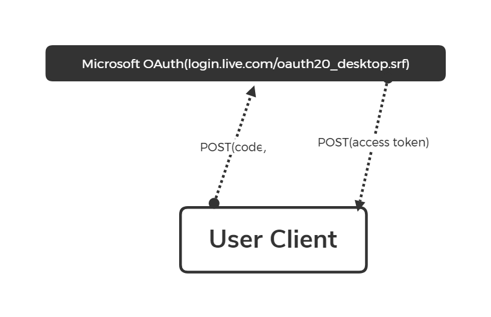

# 开始你的探索之旅

### Login with Microsoft Account

第一步自然是先让用户登陆微软账户，不过这玩意儿我们没法控制，所以说需要一个Web容器来加载这个页面，加载完成后再获取重定向的Url作为id获取下一步的Token。
根据wiki.vg的指南，这个url应该是这样的:
```
https://login.live.com/oauth20_authorize.srf
?client_id=00000000402b5328
&response_type=code
&scope=service%3A%3Auser.auth.xboxlive.com%3A%3AMBI_SSL 
&redirect_uri=https%3A%2F%2Flogin.live.com%2Foauth20_desktop.srf
```
其中，client_id为minecraft在azure的服务名，response_type为返回结果类型，scope为验证服务的类型，redirect_uri为返回的重定向链接。(不要修改任意一条，这些都是minecraft在申请azure时被硬编码过的)。
在用户登陆Microsoft账户后，Microsoft OAuth将重定向到以`https://login.live.com/oauth20_desktop.srf?code=`开头的链接，=后(不包括=)就是我们要的code了。
下面是一个简单的示范，作者使用了Java Chromium Embedded Framework(JCEF)，基于Java编写。
```java
        CefApp.addAppHandler(new CefAppHandlerAdapter(null) {
            @Override
            public void stateHasChanged(org.cef.CefApp.CefAppState state) {
                if (state == CefApp.CefAppState.TERMINATED) System.exit(0);
            }
        });
        CefSettings settings = new CefSettings();
        settings.windowless_rendering_enabled = false;
        CefApp cefApp=CefApp.getInstance(settings);
        CefClient cefClient = cefApp.createClient();
        CefBrowser cefBrowser = cefClient.createBrowser(MicrosoftOAuthUrl, false, false);
        //MicrosoftOAuthUrl为上面拼接好的链接
        getContentPane().add(cefBrowser.getUIComponent(), BorderLayout.CENTER);
        pack();
        setTitle("Test For MSA");
        setSize(1260, 720);
        setVisible(true);
        addWindowListener(new WindowAdapter() {
            @Override
            public void windowClosing(WindowEvent e) {
                CefApp.getInstance().dispose();
                dispose();
            }
        });
        cefClient.addDisplayHandler(new CefDisplayHandler() {
            @Override
            public void onAddressChange(CefBrowser cefBrowser, CefFrame cefFrame, String s) {
                if (s.contains("https://login.live.com/oauth20_desktop.srf?code=")){
                    System.out.println(s.substring(s.indexOf("=")+1));
                }
            }

            @Override
            public void onTitleChange(CefBrowser cefBrowser, String s) {

            }

            @Override
            public boolean onTooltip(CefBrowser cefBrowser, String s) {
                return false;
            }

            @Override
            public void onStatusMessage(CefBrowser cefBrowser, String s) {

            }

            @Override
            public boolean onConsoleMessage(CefBrowser cefBrowser, CefSettings.LogSeverity logSeverity, String s, String s1, int i) {
                return false;
            }
        });
```

### Get Access Token

这一步就是获取Access Token，具体原理如图：
  
<a href="document/User-Client.pdf" target="_Blank">下载PDF</a>  
向[Microsoft OAuth](https://login.live.com/oauth20_desktop.srf)发送一个POST请求，负载格式为JSON，下面是一个例子：
```json
{
    "client_id": "00000000402b5328",
    "code": [上一步你得到的code],
    "grant_type": "authorization_code",
    "redirect_url": "https://login.live.com/oauth20_desktop.srf",
    "scope": "service::user.auth.xboxlive.com::MBI_SSL"
}
```
服务器POST回传JSON应该这个格式：
```json
   "token_type": "bearer",
   "expires_in": 86400,
   "scope": "service::user.auth.xboxlive.com::MBI_SSL",
   "access_token": [token],
   "refresh_token": [refresh_token],
   "user_id": [user_id],
   "foci": "1"
```
